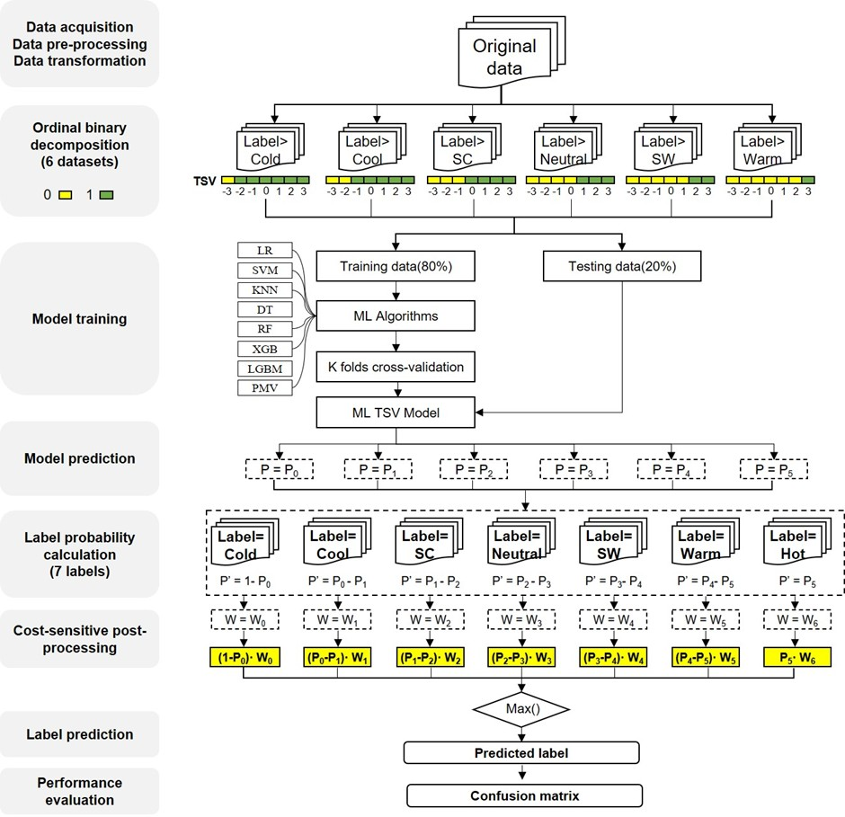
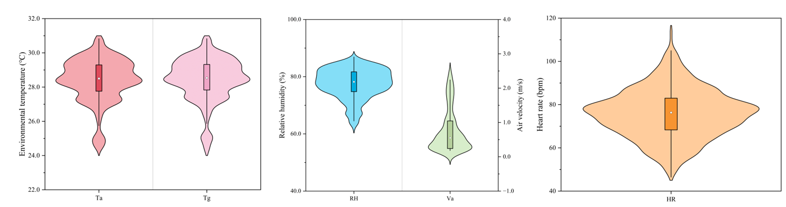

# Thermal-comfort-predict


 

## Environment
- The code is tested on python 3.8, pytorch 2.4, cuda 11.


## Installation
 1. Clone this repository
  ```bash
  git clone https://github.com/kailaisun/Thermal-comfort-predict
  ```
  
 2. Install 
  ```bash
  pip install -r requirements.txt
  ```


 ## Correlation analysis
```Bash
python correlation-analysis.py
```
You will get some figures, which can represent the correlation between features.

 ## Test Machine Learning (ML) algorithms
```Bash
python predict_ML.py
```
You can change different Machine learning algorithms (e.g., XGB boost,Random Forest, Logistic Regression) on lines 117 and 130.

 ## Test Deep Learning (DL) algorithms
```Bash
python predict_Transformer_DNN.py
```
You can change different Deep learning algorithms (e.g., DNN, Transfromer) on lines 140 and 155.

 
 
 

## Citation

Please refer to the following bibtex to cite.


## Contact Us

If you have other questions❓, please contact us in time 👬


